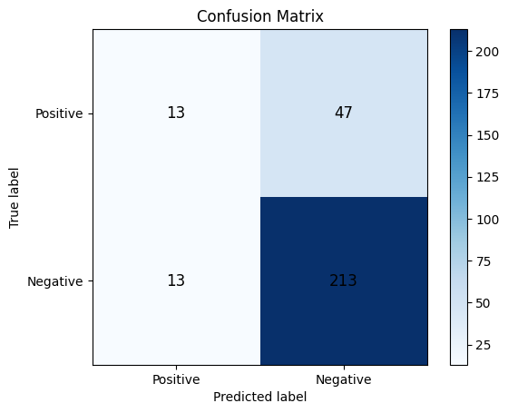
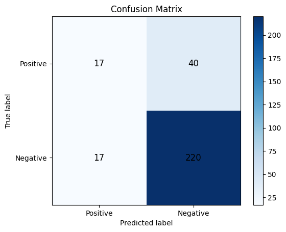

# First Draft of Final Project
Connor Villanueva & Curtis Jurtis Bradley

## Modeling and Feature Development
The goal for our current models is to predict the Top 3 teams of a given tournament by using steam market sale data.

The items in the market data are all items that are associated with a specific team that was in the given tournament.

Evaluation was done with `Precision`, `Recall`, and `Accuracy` measurements.

### Random Model
This model is used as a baseline model for comparison with others.

When given an `event` (a tournament), it will randomly pick 3 participating teams.

The results are as follow:

|   Precision   |   Recall  |   Accuracy    |
| ------------- | --------- | ------------- |
|   0.1250      | 0.1533    | 0.1803        |

### Volume Based Heuristic Model
This was a simple model made to see how a heuristic approach would perform against a random model. This model aggregated the total volume sold of items relating to each team in a given tournament, picking the teams with the top 3 most volume of items sold. These volume of items was only considered during the given tournament's `start_date` and `end_date`.

The results are as follows:

|   Precision   |   Recall  |   Accuracy    |
| ------------- | --------- | ------------- |
|   0.2125      | 0.2567    | 0.2043        |

### Money Spent Based Heuristic Model
This was another simple model made to see how a heurstic approach would perform against a random model. At the same time, both this and the previous model give a good idea about the performance of self-constructed features.

The resuls are as follows:

|   Precision   |   Recall  |   Accuracy    |
| ------------- | --------- | ------------- |
|   0.2250      | 0.2600    | 0.2060        |

## Overview
Overall we learned that aggregated statistics of volume and money spent are significant features to our models. However, these values aren't great at predicting the top teams potentially due to a high number of sales towards the start of the tournament due to hype.

Our next goal is to build a model that analyzes the $\Delta Volume$ or $\Delta MoneySpent$ per day and see how this model would compare against these baseline models. Additionally, looking at the $\Delta$ values could even allow us to predict how live tournaments may play out.

Our other idea is to only look at `autograph` stickers. These stickers tend to be more sought after than the normal `team` stickers, so they may provide a stronger signal.
