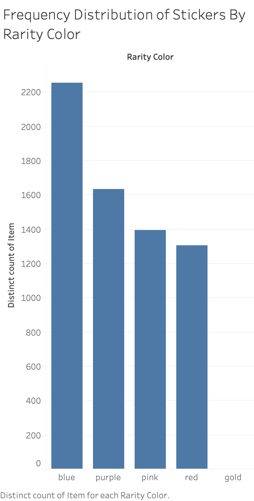
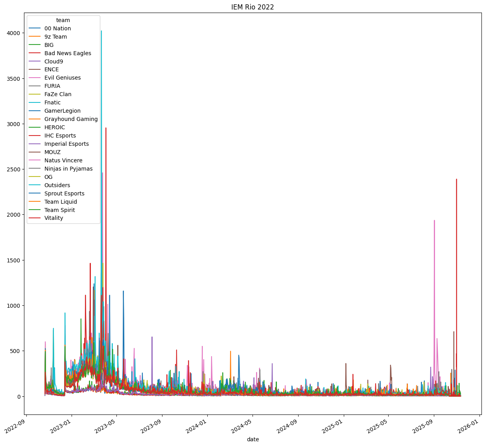
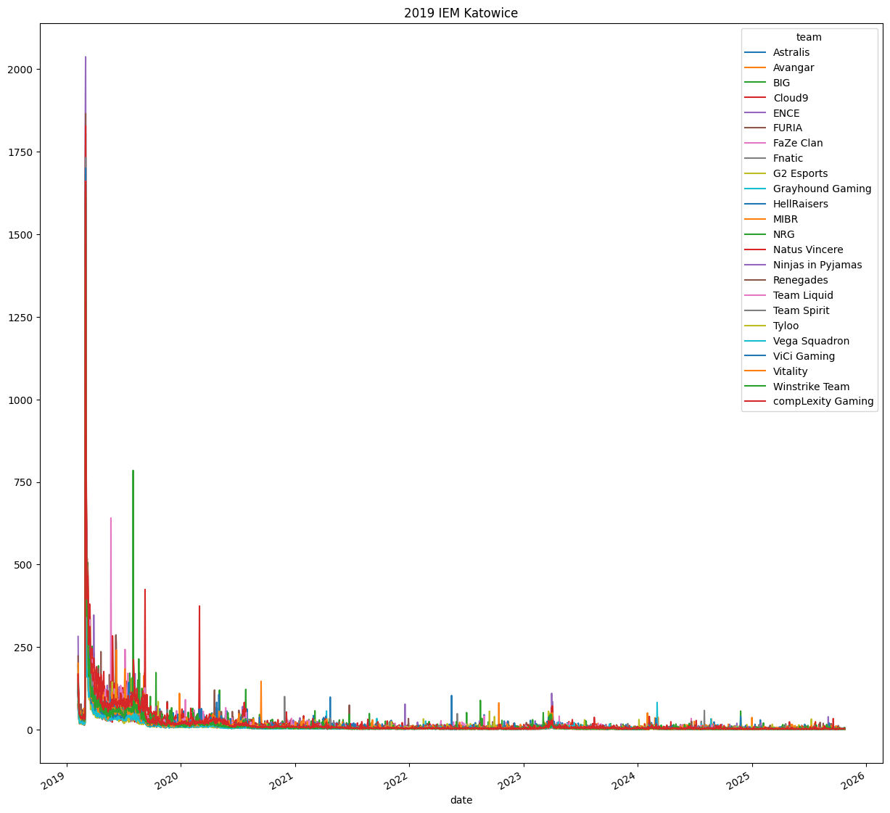
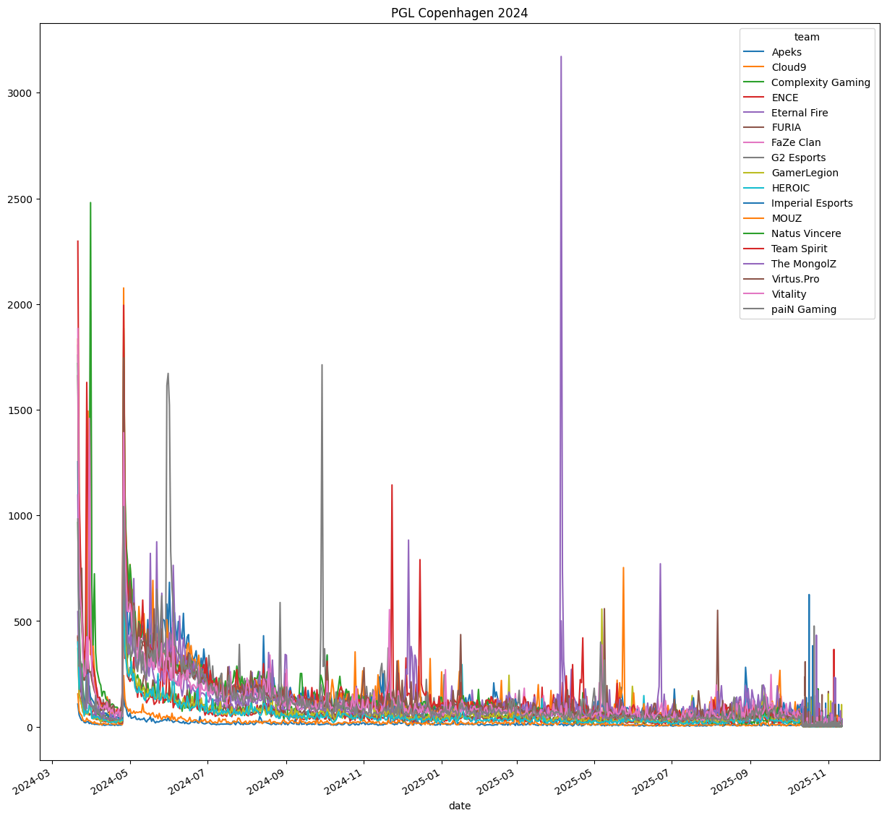

# Gather Data + EDA for Final Project
Curtis Bradley & Connor Villanueva

## Dataset Selection
Our dataset is Steam Community Market Data from CSGO/CS2. We chose this dataset because we were originally interested in predicting market trends and seeing how different models perform with this task. 

However, after discussing with Pierce, we decided to switch our topic slightly. Now we are interested in seeing if we can predict winning teams/top players from tournmanets by viewing market data during a window of time from before the tournament until after. 

This dataset was obtained by sending HTTP requests to the following URL: `https://steamcommunity.com/market/pricehistory/?appid=730&market_hash_name={ITEM}` where `ITEM` is the name of CSGO/CS2 item that has been url encoded. This data was then combined with results from an unofficial JSON API, `https://raw.githubusercontent.com/ByMykel/CSGO-API/main/public/api/el/`, that we found at the following link with instructions: `https://bymykel.com/CSGO-API/#introduction`

The official Steam Community Market provides the median price and volume sold in the following way:

- Hourly for data within the last month
- Daily for data that is over a month old

## Exploratory Data Analysis (EDA)

Here is the frequency distribution of stickers by rarity color. This is ordered in increasing rarity, so the results are what we expected. There are more blues than any other color because these are the most common stickers. There is actually a single gold sticker, that is of type `contraband`, and is the `Howling Dawn` sticker.

Here is an example distriubtion of volume of stickers sold during a tournament period as mentioed above. This was for `IEM Rio 2022`. On the left side, we see a light blue peak corresponding to the winners of the tournament, `Outsiders`. This example examples matches our hypothesis about being a measure of success in a tournmanet.

Here's an example of the same distrubtion for another tournament period, `IEM Katowice 2019`. The winners of this tournament was team `Astralis`, with second place being team `ENCE`. This graph was a little more questionable than the previous. There is a very defined peak on the left-hand side of the graph that, yet the tallest line corresponds to `ENCE`. We need to look further into this, but our hypothesis is that as time approaches the final matches, sticker sales correspond to community predictions.

Lastly, here's an example of a distribution where predictions become very difficult. This was `PGL Copenhagen 2024`, where the winning team was `Natus Vincere`. We can see on the far left that there are two primary peaks that roughtly correspond to the top placing teams, including Natus, but after the tournament ends we still see these peaks occurring that don't correspond to any of htese top teams. Especially in around April of 2025, we see a large spike in sales for a team that did not even end up in the top 5. This tells us that when doing predictions, we will need to narrow our scope of time.

## Issues/Open Questions
The major issues we are having is related to actually retrieving data. For example, to obtaining the Steam Market Data required sending `GET` requests to the url mentioned earlier. However, Steam would time you out if you exceed their limit, which meant obtaining the data took a long time. Along with this, trying to find a way to obtain individual item data, such as sticker information (i.e. tournaments/teams if it applied) was a long process.

Our next step is to obtain individual tournament data, such as player performance, player highlights, and player weapon skins to see if we can incorporate weapon skins into our predictions. Our hypothesis regarding that is that weapon skins that are seen during highlights may see an increase in sales during or shortly after a tournament.